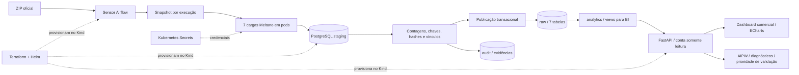

# BanVic — Plataforma de dados e inteligência comercial

Pipeline de ingestão das **sete tabelas do ERP** do BanVic, com Kubernetes local, infraestrutura como código, Meltano, Airflow e PostgreSQL. Preserva a origem, reconcilia todos os valores e publica as sete tabelas em uma única transação.

O **dashboard comercial** conecta essa plataforma à análise de atividade, retenção, agências e crédito. A área de alavancas apresenta ranking quantitativo para validação, estimativas ajustadas, intervalos de incerteza e planejamento de piloto. A fonte não registra intervenções ou custos: a aplicação explicita que **nenhum efeito causal de investimento está identificado**, sem transformar associação em garantia de retorno.

**Conferência final dos requisitos em 05/10/2026:** 30 testes aprovados, dez grupos HTTP, cinco cenários reais de resiliência, 76.206 linhas integralmente reconciliadas e três módulos Terraform sem diferenças. A execução final terminou em 55,826 s. Consulte a [matriz completa de requisitos e limites](docs/REVISAO_FINAL_REQUISITOS.md); evidências em `evidence/review3/` e `evidence/commercial/`. Vídeo fora desta revisão, conforme solicitado.

Operação comercial em [DASHBOARD_COMERCIAL.md](docs/DASHBOARD_COMERCIAL.md), análise em [RESULTADOS_COMERCIAIS.md](docs/RESULTADOS_COMERCIAIS.md) e critérios em [METODOLOGIA_CAUSAL.md](docs/METODOLOGIA_CAUSAL.md).

As [revisões de 04/10/2026](docs/REVISAO_COMPLETA.md) e a [validação inicial](docs/VALIDACAO.md) foram preservadas como histórico. Seus números de testes e escopo correspondem às versões verificadas naquelas etapas.

## Arquitetura



A [documentação da arquitetura](docs/ARQUITETURA.md) detalha decisões, segurança, limites e publicação.

## Pré-requisitos

Ambiente de referência: Windows com WSL 2, Ubuntu 22.04 e Docker Desktop integrado ao Ubuntu. No Linux, é possível usar Docker Engine e os mesmos scripts. O instalador atende Linux x86_64.

- Pelo menos 8 GB disponíveis para Docker/WSL; 12 GB recomendados. O ambiente de referência dispõe de 15 GB.
- Aproximadamente 20 GB livres para imagens, volumes e ferramentas.
- Internet na primeira instalação e construção das imagens.
- ZIP oficial da certificação. Kaggle e `banvic-dbt` não são substitutos validados desta fonte.

### 1. Preparar o computador

Instale o [Docker Desktop](https://docs.docker.com/desktop/setup/install/windows-install/), habilite WSL 2 e marque Ubuntu em **Settings → Resources → WSL Integration**. Se necessário, execute no PowerShell administrativo:

```powershell
wsl --install -d Ubuntu-22.04
```

Reinicie quando solicitado e crie o usuário Ubuntu. Execute os próximos comandos **dentro do Ubuntu**, como usuário comum:

```bash
cd /mnt/c/Users/mateu/Desktop/data-engineer-indicium
sudo bash scripts/install_linux_tools.sh
bash scripts/install_python_tools.sh
docker info
bash scripts/install_meltano_connectors.sh
bash scripts/download_images.sh
bash scripts/check_environment.sh
```

Adapte o caminho à sua cópia. A instalação Linux exige sudo; deploy e execução não. Consulte [VERSOES.md](docs/VERSOES.md). Os Dockerfiles e scripts fixam versões e digests.

### 2. Disponibilizar a fonte

Coloque `Dados Banvic.zip` na raiz ou informe seu caminho no deploy. O script copia o ZIP para o volume Linux como `banvic_data.zip`, sem modificar o conteúdo. Ele fica fora do Git e do pacote de código.

| Tabela | Linhas da fonte oficial verificada |
|---|---:|
| agencias | 10 |
| clientes | 998 |
| colaborador_agencia | 100 |
| colaboradores | 100 |
| contas | 999 |
| propostas_credito | 2.000 |
| transacoes | 71.999 |
| **Total** | **76.206** |

SHA-256 da fonte: `646aada76645cab694741fa730d9792b40840c41823abb60bd7547a2038ba790`.

### 3. Subir o ambiente

```bash
bash scripts/deploy.sh
# Ou: bash scripts/deploy.sh '/caminho/banvic_data.zip'
bash scripts/access.sh
```

O deploy cria o cluster `banvic`, constrói e carrega duas imagens, aplica Terraform, gera credenciais e instala o chart oficial Airflow. A primeira execução demora mais devido aos downloads. Repetir reaproveita cluster, credenciais e volumes.

Dados, logs, credenciais e estado do Terraform ficam em `~/banvic-local`, fora do repositório. Para outro diretório, defina `BANVIC_HOME` em **todas** as execuções. Evite mudar esse caminho depois da criação: os mounts do Kind apontam para o diretório original.

### 4. Acessar e executar

- Airflow: **http://localhost:8080**; usuário `admin`.
- Senha: campo `airflow_admin` em `~/banvic-local/secrets/credentials.json`.
- PostgreSQL: `localhost:5433`, banco `banvic_dw`, usuário `banvic_analyst`; senha no campo `analyst` do mesmo arquivo.

Consulte as credenciais somente no seu terminal. Não filme nem publique esse arquivo.

```bash
bash scripts/run_pipeline.sh
```

Ou abra `banvic_ingestion` no Airflow e clique em **Trigger**. O agendamento é diário às 06:00 em `America/Sao_Paulo`, sem catchup. O script ativa a DAG antes da execução manual.

### 5. Verificar o resultado

```bash
bash scripts/verify.sh
```

Espere as contagens acima e uma execução `published` em `audit.ingestion_runs`. Views para analistas:

- `analytics.transacoes_mensais`: transações, clientes e valores por mês e agência.
- `analytics.atividade_clientes`: atividade e inatividade relativa à última data do histórico.
- `analytics.credito_por_status`: propostas e valores por status.

Um cliente SQL ou Power BI pode usar a conta de leitura. As quatro views adicionais `analytics.commercial_*` alimentam o dashboard e permanecem disponíveis para outros consumidores.

### 6. Implantar e acessar o dashboard

Após a primeira ingestão concluída:

```bash
bash scripts/deploy_commercial.sh
bash scripts/access.sh
```

Abra **http://localhost:8090**, usuário **`comercial`**, senha no campo **`dashboard_admin`** do arquivo privado de credenciais. O pacote já inclui os arquivos ECharts e sua licença; Node/npm só são necessários para alterar essa dependência. O deploy constrói a terceira imagem e aplica `infra/commercial`, com estado privado fora do repositório.

São seis telas, com filtros por período, canal e agência, pesquisa de unidades, coortes, diagnósticos de evidência, simulador de tamanho amostral e exportação CSV. Nenhum nome, documento ou identificador de cliente é enviado ao navegador. O padrão é outubro–dezembro/2022; janeiro/2023 é parcial. Consulte o [guia de uso e as definições](docs/DASHBOARD_COMERCIAL.md).

## Ingestão e resiliência

A fonte é um **snapshot completo**, sem CDC. Cada execução congela uma cópia validada e carrega em schema próprio. Meltano usa `tap-csv` e `target-postgres` com chaves declaradas, full refresh e upsert. `config/data_contract.json` verifica arquivos, cabeçalhos, tipos e chaves antes da carga.

Colunas `text` em `raw` preservam valores e zeros à esquerda. As views convertem os tipos. A validação compara contagens e hashes de **todos os valores**, chaves e relações. A fonte contém uma conta e quatro propostas ligadas a um cliente ausente; esses cinco vínculos viram avisos e são preservados. Problemas adicionais introduzidos pela ingestão bloqueiam a publicação.

As sete tabelas e o marcador de snapshot são publicados na mesma transação. Uma falha provoca rollback. A DAG executa uma vez por vez, usa retries e registra falhas sem transformar a execução em sucesso. Republicar uma execução concluída não altera os dados; reprocessar o ZIP mantém os dados de negócio.

## Testes

```bash
bash scripts/test.sh
# Depois da primeira ingestão bem-sucedida:
bash scripts/test.sh --integration
bash scripts/test_commercial.sh
python3 scripts/verify_commercial.py --evidence-dir evidence/commercial

# Use run IDs novos ao repetir os cenários:
bash scripts/run_pipeline.sh teste_retry --fail-once contas
bash scripts/run_pipeline.sh teste_falha --fail-always contas
```

A falha transitória se recupera no retry. A permanente deve terminar com DAG failed, código de saída diferente de zero e preservação do snapshot anterior. A injeção só acontece quando solicitada nos parâmetros.

Os testes verificam segurança do ZIP, contrato da fonte, repetição da preparação, reconciliação integral, republicação e rollback após falha em uma tabela posterior da publicação.

## Operação

```bash
export KUBECONFIG="$HOME/banvic-local/kubeconfig"
kubectl -n banvic get pods
kubectl -n banvic get pvc
kubectl -n banvic logs statefulset/airflow-scheduler -c scheduler --tail=80
```

Consulte [OPERACAO.md](docs/OPERACAO.md). A POC usa autenticação local, volumes neste computador e métricas StatsD no cluster. Produção exige SSO, TLS, backup, retenção e infraestrutura gerenciada conforme a arquitetura documentada.

## Entrega

```bash
python3 scripts/package_delivery.py
```

`delivery/banvic-projeto.zip` inclui código, configuração, documentação e evidências públicas; exclui fonte, credenciais, estado Terraform, caches e logs privados. A apresentação atual é `delivery/BanVic-Apresentacao-Certificacao.pptx`, com dez slides; consulte [APRESENTACAO.md](docs/APRESENTACAO.md). Os materiais anteriores permanecem como histórico.

O enunciado exige um vídeo de três a cinco minutos na entrega. Esta revisão não executou gravação, narração ou geração de vídeo; os materiais existentes foram preservados. A exclusão dessa atividade da revisão não altera o requisito da certificação.

O [plano inicial](docs/PLANO_IMPLEMENTACAO_BANVIC.md) registra a preparação anterior à implementação. Os comandos da solução final estão neste README.
