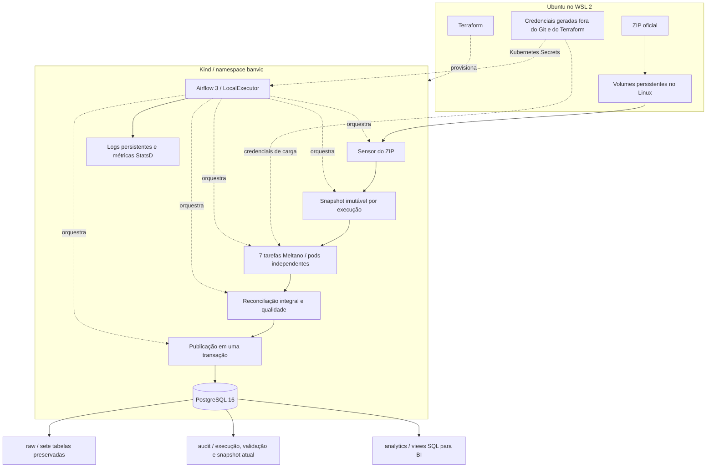

# Arquitetura e decisões

## Escopo

A POC centraliza as sete cópias do ERP fornecidas no arquivo oficial `Dados Banvic.zip`. O nome de entrega no volume é `banvic_data.zip`; o conteúdo do arquivo permanece intacto. Não utiliza os dados do repositório dbt ou do Kaggle como fonte substituta.

O desafio de Engenharia de Dados exige infraestrutura, ingestão, orquestração e demonstração. As views analíticas oferecem um ponto de partida para BI. Um dashboard comercial completo, previsão de churn ou ranking causal de investimentos exigem uma etapa adicional com definições de negócio e validação estatística. Correlações históricas não garantem retorno de um investimento.

## Componentes

## Escolhas

| Decisão | Motivo e limite |
|---|---|
| Kind com um nó | Kubernetes real, local e reproduzível. A persistência depende deste computador. |
| Terraform em duas etapas | A primeira provisiona namespace, armazenamento e PostgreSQL. Os Secrets entram por um canal separado. A segunda instala o chart oficial do Airflow. |
| Chart Airflow 1.22.0 | Reduz configuração manual dos componentes e permite acompanhar a release com Terraform. |
| LocalExecutor e KubernetesPodOperator | Poucos serviços permanentes. Cada tarefa de ingestão executa em um pod com dependências próprias. |
| Meltano com tap-csv e target-postgres | Extração e carga pelo protocolo Singer. Não substituímos a ferramenta exigida por um carregador Python próprio. |
| Snapshot completo | A origem é uma exportação de arquivos sem CDC. Não há campo de atualização confiável comum às sete tabelas. |
| raw com colunas text | Preserva os valores de origem, incluindo zeros à esquerda em documentos e CEP. Views convertem datas e valores monetários explicitamente. |
| PostgreSQL para metadados e warehouse | Bancos e usuários distintos no mesmo servidor reduzem consumo na POC. Produção deve separar operação do orquestrador e dados analíticos. |
| Volumes locais com política Retain | Dados e logs ficam fora do container e sobrevivem à recriação do cluster quando os mesmos diretórios são reutilizados. Não substitui backup. |

## Integridade e idempotência

1. O sensor aguarda o ZIP. O script de entrega troca o arquivo por rename, evitando leitura de uma cópia incompleta.
2. A preparação copia o ZIP para um diretório exclusivo, valida o contrato e registra SHA-256, linhas e digest dos valores. Tentativas repetidas reutilizam esse snapshot, mesmo que a fonte de entrada mude.
3. Cada tabela carrega em um schema `stg_<hash da execução>`. Antes de repetir uma carga, a tarefa recria somente a tabela de staging que lhe pertence.
4. O tap declara as chaves da tabela. O target usa upsert, com full refresh e sem estado incremental. A próxima execução usa outro schema, portanto exclusões no novo snapshot também são refletidas no destino publicado.
5. A validação compara todos os valores do destino com a fonte. O digest independe da ordem, preserva duplicatas, células vazias e diferenças entre string vazia e null. Contagem de linhas e unicidade das chaves são verificadas separadamente.
6. A publicação adquire um lock transacional, valida novamente o staging e troca o conteúdo das sete tabelas e o marcador de publicação na mesma transação. DELETE e INSERT preservam nomes, permissões e views. Um erro faz rollback de todas as alterações.
7. Repetir a publicação de uma execução concluída retorna `already_published`. Uma nova execução do mesmo ZIP mantém os mesmos dados de negócio e acrescenta uma execução à auditoria.

`max_active_runs=1` impede duas execuções simultâneas desta DAG. O lock no PostgreSQL também serializa a publicação. Consultas individuais veem o snapshot anterior ou o novo. Para uma análise com várias consultas que precise de uma única fotografia, o consumidor deve usar uma transação REPEATABLE READ.

## Qualidade da origem

O arquivo oficial possui uma conta e quatro propostas de crédito que referenciam cliente ausente. O pipeline registra esses cinco vínculos como avisos e preserva todas as linhas. O número de vínculos ausentes no staging deve ser exatamente igual ao encontrado na fonte daquela execução. A reconciliação integral garante que a ingestão não alterou quais registros apresentam esse problema.

Falhas de schema, ZIP inválido, membro inseguro, tabela ausente, chave nula/duplicada, data/número inválido, diferença de linhas ou valores bloqueiam a publicação. Não criamos clientes artificiais nem descartamos registros para fazer o teste passar.

## Segurança

- Senhas fortes são geradas uma vez no diretório privado do usuário Linux, com permissões 700/600, e reaproveitadas no redeploy.
- O bootstrap envia os Secrets pela entrada padrão do kubectl. As credenciais não entram nos Dockerfiles, DAGs, Git, planos ou estado do Terraform.
- Usuários `airflow`, `banvic_etl` e `banvic_analyst` têm propósitos distintos. O analista recebe acesso de leitura ao raw, às views e aos indicadores de auditoria.
- Pods de ingestão executam como usuário 1000, sem privilégios e sem token de service account. Apenas o scheduler possui RBAC para criar e acompanhar os pods no namespace.
- PostgreSQL e Airflow usam ClusterIP. Port-forward liga somente em 127.0.0.1.
- O SimpleAuthManager protege a interface com uma senha aleatória. É adequado à demonstração local. Produção requer um gerenciador de autenticação com SSO, TLS e controles corporativos.
- O namespace oferece organização e RBAC. O CNI padrão do Kind não oferece isolamento de tráfego por NetworkPolicy. Não há promessa de isolamento de rede que o ambiente não implemente.
- Logs da aplicação registram eventos, contagens e hashes, sem imprimir registros pessoais ou senhas.

## Monitoramento e operação

A interface do Airflow expõe estado, duração, tentativas e logs de cada tarefa. Os logs permanecem no volume local. O chart também instala o exporter StatsD, disponível dentro do cluster. A auditoria no warehouse registra origem, contagens, resultado de qualidade, início, fim e último snapshot publicado.

Há duas tentativas adicionais com espera crescente. Uma tarefa específica registra a falha na auditoria. O nó final de sucesso depende da publicação, impedindo que o tratamento de erro transforme uma DAG malsucedida em sucesso.

Para esta POC, staging e snapshots são preservados para inspeção e testes. Em operação contínua, aplicar retenção somente às execuções encerradas, com backup, e dimensionar o crescimento dos volumes. Não há limpeza automática de evidências durante a certificação.

## Referências

[Kind](https://kind.sigs.k8s.io/docs/user/quick-start/), [Terraform Kubernetes Provider](https://registry.terraform.io/providers/hashicorp/kubernetes/latest/docs), [chart oficial Airflow](https://airflow.apache.org/docs/helm-chart/stable/index.html), [KubernetesPodOperator](https://airflow.apache.org/docs/apache-airflow-providers-cncf-kubernetes/stable/operators.html), [SimpleAuthManager](https://airflow.apache.org/docs/apache-airflow/3.2.2/core-concepts/auth-manager/simple/index.html), [Meltano run](https://docs.meltano.com/reference/command-line-interface/#run), [tap-csv](https://github.com/MeltanoLabs/tap-csv), [target-postgres](https://github.com/MeltanoLabs/target-postgres).
