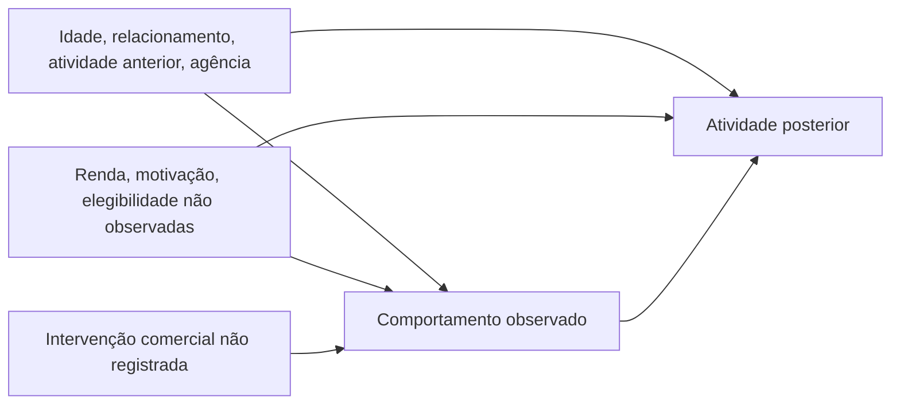

# Alavancas comerciais: identificação, estimação e validação

## Decisão suportada pela fonte

O ERP permite comparar comportamentos e a atividade posterior. Não registra campanhas, convites, grupos sorteados, custos, margem, renda, limites de cartão ou histórico de migração de agência. Também não registra aprovação/desembolso de crédito ao longo do tempo. Portanto, **não identifica o efeito causal de um investimento comercial** nem permite calcular ROI incremental.

A entrega inclui um ranking quantitativo de **prioridade para validação** e uma camada explícita de identificação causal. Na fonte atual, essa camada retorna zero efeitos identificados e uma lista causal vazia. Significância estatística, balanceamento e um estimador sofisticado não substituem uma intervenção definida e uma estratégia de identificação. O fluxo de modelar, identificar, estimar e testar robustez segue a distinção descrita na [documentação primária do PyWhy](https://www.pywhy.org/dowhy/v0.13/user_guide/causal_tasks/estimating_causal_effects/index.html).

## Hipótese causal e caminhos não observados



O grafo é uma hipótese de domínio, não uma estrutura aprendida e comprovada pelo ERP. O caminho `A ← U → Y` permanece aberto. Incentivar o uso de um produto também não equivale a impor o comportamento observado: aderentes podem diferir dos demais mesmo depois do ajuste disponível. O resultado atual deve ser lido como contraste observacional padronizado, condicionado às escolhas do modelo.

Para um efeito causal, seriam necessárias consistência do tratamento, ausência de interferência relevante, positividade e intercambialidade condicionada às variáveis de ajuste, além de datas e medições confiáveis. O código não considera essas hipóteses demonstradas na base. Uma intervenção registrada com sorteio, ou uma estratégia observacional defensável com confundidores adequados, exigiria revisão do protocolo e da análise antes de liberar a classificação causal. O mecanismo de classificação não executa do-calculus nem comprova automaticamente as hipóteses.

## Desenho temporal

Um cliente ocupa uma linha. Contas devem estar abertas antes do início da janela de ajuste; somente clientes com cadastro identificado são elegíveis. Isso evita incluir aberturas posteriores como se tivessem oportunidade completa de exposição. Na análise de **2022-Q4**, são **888 clientes**:

| Etapa | Janela | Uso |
|---|---|---|
| Seleção prévia | Janeiro–março/2022 | Diagnóstico exploratório de atividade anterior |
| Ajuste | Abril–junho/2022 | Variáveis anteriores à exposição |
| Exposição | Julho–setembro/2022 | Pix realizado, compra no crédito e modalidades usadas |
| Desfecho | Outubro–dezembro/2022 | Transações por cliente/mês e presença de atividade |
| Sensibilidade | Outubro–novembro/2022 | Reestimação sem o mês final de volume atípico |

Exposições binárias: ao menos um Pix realizado; ao menos uma compra no crédito; três ou mais modalidades distintas; conta na agência digital. O canal usa o vínculo do snapshot e não um histórico de migração. Não equivale a uso do aplicativo.

Ajuste: idade na janela, tempo de relacionamento, frequência e diversidade anteriores, recência, agência e cidade. Agência é retirada do ajuste do contraste digital porque define a própria exposição. Saldo atual e status atual de propostas não entram no modelo. Idade usa imputação da mediana e limites de 18 a 100 anos; a hipótese deve ser revista para outras populações.

O primeiro desfecho inclui também clientes com zero transações, dividindo o total do trimestre por três. O segundo é a presença de ao menos uma transação no trimestre; não é retenção contratual ou churn confirmado. A sensibilidade divide o total dos dois meses por dois. A seleção prévia compara a frequência trimestral anterior, sem substituir um teste de tendências paralelas ou uma análise de confundimento não observado.

## Estimador e incerteza

Implementação em `commercial/causal.py`: AIPW com cross-fitting de cinco folds estratificados, seed `20261004`, regressão logística regularizada (`C=0,5`) para a propensão e modelos Ridge (`alpha=5`) separados por exposição para o desfecho. Imputação, escala e categorias são ajustadas somente nas observações de treino de cada fold; estimativas de propensão e desfecho são produzidas fora da amostra usada para treiná-las.

Para cada cliente, o escore é:

```text
ψ = m1(X) − m0(X)
    + A × [Y − m1(X)] / e(X)
    − (1 − A) × [Y − m0(X)] / [1 − e(X)]
```

A estimativa é a média dos escores no suporte comum. O erro padrão é o desvio dos escores dividido pela raiz do tamanho dessa amostra. O termo “duplamente robusto” depende da correção de pelo menos um dos modelos auxiliares e das hipóteses de identificação; não protege contra confundidores omitidos. A referência de [Zivich e Breskin sobre cross-fitting](https://arxiv.org/abs/2004.10337) discute propriedades e limitações de amostras finitas. Esta POC usa modelos paramétricos regularizados, sem afirmar que reproduz todas as configurações daquele estudo.

| Critério de cálculo ou diagnóstico | Regra implementada |
|---|---|
| Amostra inicial | ≥80 clientes e ≥20 em cada grupo |
| Propensão no suporte | Intervalo inclusivo [0,05; 0,95] |
| Amostra após trimming | ≥60 clientes e ≥15 em cada grupo |
| Cobertura para prioridade | ≥80% dos clientes no suporte |
| Amostra efetiva ponderada | ≥30 por grupo, `ESS = soma(w)² / soma(w²)` |
| Desequilíbrio ponderado | Maior diferença padronizada absoluta (SMD) ≤0,20 |
| Estabilidade para prioridade | Mesmo sinal no desfecho completo e sem o mês final |

Os limiares são decisões explícitas da POC, não certificados de ausência de viés. O corte de propensão muda a população alvo; cada contraste pode ter suporte diferente, limitando a comparação entre eles. O sinal estável não implica magnitude estável ou significância.

São apresentados ICs individuais de 95% e ICs simultâneos por Bonferroni para a família de **quatro exposições × dois desfechos principais**. Os p-valores principais recebem ajuste de Holm, mantendo a família de oito mesmo quando um recorte torna algum contraste não estimável. Sensibilidade, seleção prévia e a busca entre diferentes filtros são exploratórias; não há correção para todas as consultas que um usuário pode realizar. Os intervalos usam aproximação normal e não incorporam toda a incerteza do trimming e da especificação dos modelos. Não há desenho por clusters; com uma única agência digital, não é possível separar de modo confiável efeito de canal e efeito daquela unidade.

## Regra do ranking e resultados

Apenas contrastes que passam pelos diagnósticos e mantêm o sinal recebem prioridade. A ordenação usa o **limite inferior do IC simultâneo de transações por cliente/mês**, do maior para o menor. Isso define uma ordem de investigação. Não exige que o limite seja positivo e não deve ser interpretado como aprovação de investimento.

Resultados do container com dependências fixadas, para 2022-Q4, publicados em `evidence/commercial/`:

| Prioridade de validação | Contraste | Δ transações/cliente/mês | IC individual 95% | IC simultâneo 95% | p Holm, transações | Diagnóstico |
|---:|---|---:|---|---|---:|---|
| 1 | Uso do cartão de crédito | +1,13 | −0,01 a +2,27 | −0,46 a +2,72 | 0,208 | Aprovado |
| 2 | Uso do Pix | +0,92 | −0,16 a +2,00 | −0,58 a +2,43 | 0,281 | Aprovado |
| 3 | Relacionamento com 3+ modalidades | +0,40 | −0,83 a +1,62 | −1,32 a +2,11 | 0,527 | Aprovado |
| — | Agência digital | −1,79 | −2,92 a −0,66 | −3,36 a −0,22 | 0,009 | Reprovado |

Os três contrastes priorizados têm intervalos que incluem zero para frequência. A agência digital retém cerca de 79,3% no suporte e tem SMD máximo de 0,34: não entra no ranking, apesar do p-valor baixo. O comportamento de atividade no trimestre apresenta diferenças positivas ajustadas em cartão, Pix e diversidade; ainda há confundimento não medido e nenhuma intervenção identificada. Os dois desfechos devem ser lidos separadamente.

Crédito concedido permanece bloqueado porque data de entrada não é data de aprovação/desembolso e os demais status não são decisões finais de um grupo comparável. Marketing permanece bloqueado pela ausência de exposição, atribuição, custo e margem. Nenhum retorno financeiro é calculado por aproximação a partir da movimentação bruta.

## Protocolo para medir impacto no próximo trimestre

1. Atualizar o cadastro e a atividade para uma janela recente. Definir o tratamento, elegibilidade real do produto, desfecho primário e efeito mínimo antes do piloto.
2. Escolher uma única intervenção inicial. Exemplo: orientação de ativação do cartão para clientes elegíveis que ainda não o usam, sem incentivar endividamento como meta de resultado.
3. Sortear clientes 1:1 entre ação e controle, com estratificação por agência e atividade anterior. Registrar atribuição, data, elegibilidade, entrega, adesão e contato de outros programas.
4. Acompanhar 90 dias e analisar intenção de tratar. Manter clientes que não aderiram no grupo originalmente sorteado. Registrar mudanças de política, recusas, perdas e custos.
5. Estimar diferença de transações e atividade, com IC e protocolo pré-definido. Para ROI, acrescentar margem incremental e todos os custos; monitorar também inadimplência e efeito no cliente quando a ação envolver crédito.
6. Expandir somente depois de avaliar tamanho do efeito, incerteza, custo e capacidade operacional. Mesmo um experimento bem feito produz incerteza; não garante retorno em qualquer contexto futuro.

O planejador implementa aproximação normal para dois grupos independentes, α de 5% e poder de 80%. Com a referência histórica de 955 clientes abertos antes de outubro/2022, média de 9,08 transações/mês e desvio de 8,21, um aumento mínimo relativo de 20% resulta em **321 clientes por grupo**. Para +5 pontos percentuais de atividade, são **1.259 por grupo**, acima da capacidade dessa base. São hipóteses de planejamento, calculadas separadamente para um único teste primário. Elegibilidade do produto, atrito, distribuição de contagens, novos dados e testes simultâneos exigem redimensionamento.

Dados mínimos de uma intervenção: `experiment_id`, identificador privado do cliente, população elegível, grupo sorteado, momento da atribuição, tratamento oferecido, entrega/adesão, desfechos com data, custos, margem e alterações de política. Esses registros devem ficar no ambiente protegido; o navegador recebe somente resultados agregados.
