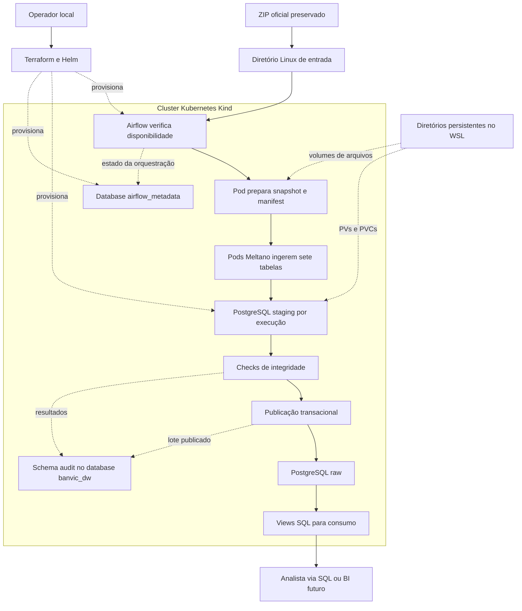
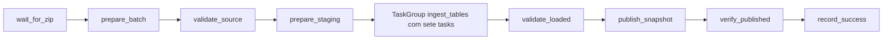

# Plano de preparação e implementação da POC BanVic

> Registro histórico da preparação, anterior à implementação. A solução já foi implantada e validada. Consulte o [README final](../README.md) para os comandos atuais e [VALIDACAO.md](VALIDACAO.md) para os resultados.

Este guia reúne o estudo do desafio, as ferramentas recomendadas e a sequência de trabalho para construir uma infraestrutura local e ingerir as sete tabelas fornecidas pela certificação. Foi preparado em **1 de outubro de 2026**, com consulta à documentação oficial.

**Recomendação:** executar uma POC em Kind, provisionar os recursos com Terraform e Helm, usar Apache Airflow para orquestrar Meltano e disponibilizar os dados em PostgreSQL.

**Atualização em 2 de outubro de 2026:** as ferramentas principais foram instaladas e verificadas, e as imagens base foram baixadas. Consultar [o registro de versões](VERSOES.md) e os scripts em `scripts/`. O restante deste documento preserva o planejamento da implementação.

O deploy do cluster, Dockerfiles do projeto, DAGs, configurações Terraform e consultas ainda serão criados. Os scripts de instalação e verificação já existem; outros scripts mencionados como planejados continuam pendentes. Não há afirmação de que o pipeline já funciona.

## 1 O resultado esperado

Uma pessoa que receber o repositório deverá conseguir:

1. Instalar os pré-requisitos descritos.
2. Colocar o ZIP oficial no diretório indicado.
3. Criar o cluster Kubernetes local.
4. Provisionar Airflow, PostgreSQL, volumes e permissões.
5. Executar uma DAG que ingere as sete tabelas.
6. Verificar sucesso no Airflow e conferir os dados por SQL.
7. Reexecutar o mesmo lote sem duplicar o resultado publicado.
8. Identificar e recuperar uma falha controlada.

Os entregáveis pedidos são o repositório ou seu ZIP, o README técnico e o vídeo de 3 a 5 minutos. Também prepararemos uma apresentação curta para orientar a demonstração.

O contexto menciona dashboard, churn, crédito e um ranking de alavancas de negócio. Minha interpretação do enunciado recebido é que a entrega avaliada nesta certificação se concentra em engenharia de dados. Dashboard e análise estatística entram como evolução, salvo se existir uma rubrica adicional exigindo esses itens.

Dados históricos podem sustentar hipóteses e estimativas; não permitem prometer retorno garantido. Um ranking de associações ou de importância de variáveis também não é, por si só, um ranking de efeitos causais de investimentos. Essa distinção deve ser preservada em qualquer evolução analítica.

## 2 O que foi encontrado no computador

Inspeção de leitura realizada no Windows e na pasta do projeto:

| Item | Situação observada | Consequência |
| --- | --- | --- |
| Sistema | Windows 11 Pro, 64 bits | Usar containers Linux e WSL 2 |
| Memória | Aproximadamente 31,9 GB | Há margem para o ambiente proposto |
| Processadores lógicos | 12 | Começar com até 6 para WSL, se necessário |
| Virtualização | Habilitada no firmware | Pré-requisito disponível |
| Disco C | Aproximadamente 596 GB livres | Há margem para imagens e volumes |
| WSL | Ubuntu 22.04 registrado em WSL 2, parado no momento | Aproveitar a distribuição existente |
| Docker | CLI 28.3.3 instalada; motor Linux inacessível no momento | Abrir Docker Desktop e testar o servidor |
| Git e kubectl | Encontrados no PATH do Windows | Ainda verificar as ferramentas dentro do Ubuntu |
| Kind, Minikube, Terraform e Helm | Não encontrados no PATH do Windows | Instalar os CLIs Linux no Ubuntu |
| Python | Python 3.12 encontrado no Windows | O runtime dos containers será independente |
| Repositório | Git inicializado, apenas README inicial antes deste estudo | Implementação ainda pendente |
| Dados | `banvic_data.zip` ausente no repositório | Inspecionar o ZIP quando ele for disponibilizado |

Não foi inspecionado o conjunto de ferramentas instalado dentro do Ubuntu. A ausência no PATH do Windows não prova ausência no Linux. Não foram instalados programas, iniciados serviços ou criados clusters nesta etapa.

## 3 Ferramentas e motivo de cada escolha

| Ferramenta | Função no projeto | Onde usar |
| --- | --- | --- |
| WSL 2 com Ubuntu | Ambiente Linux para os comandos | Windows |
| Docker Desktop | Executar e construir containers Linux | Windows, integrado ao Ubuntu |
| Kind | Executar Kubernetes local com nós em containers | CLI no Ubuntu |
| kubectl | Consultar pods, serviços, logs e volumes | CLI no Ubuntu |
| Terraform | Declarar a infraestrutura e controlar seu estado | CLI no Ubuntu |
| Helm | Empacotar a instalação oficial do Airflow | CLI e provider Terraform |
| Apache Airflow | Agendar e orquestrar as etapas | Dentro do Kubernetes |
| Meltano | Executar extração e carregamento com taps e targets | Imagem própria, executada em pods |
| tap-csv, variante MeltanoLabs | Ler CSV, caso seja o formato real do ZIP | Plugin isolado do Meltano |
| target-postgres, variante MeltanoLabs | Carregar os registros no PostgreSQL | Plugin isolado do Meltano |
| PostgreSQL | Centralizar dados e manter metadados operacionais | StatefulSet no Kubernetes |
| Python | Validar arquivos e controlar etapas auxiliares | Imagens do projeto |
| Git | Versionar código e documentação | Windows ou Ubuntu |
| DBeaver Community | Conferência visual dos dados por SQL | Opcional no Windows |
| OBS Studio | Gravar a demonstração | Opcional no Windows |

**Kind em vez de Minikube:** minha recomendação para esta POC é aproveitar o Docker existente e manter o cluster de um único nó simples de recriar. As duas opções são aceitas no enunciado; não é necessário instalar ambas. [Documentação do Kind](https://kind.sigs.k8s.io/docs/user/quick-start/).

**PostgreSQL em vez de MinIO:** sete tabelas relacionais podem ser entregues diretamente para consultas SQL. Isso reduz o número de componentes e facilita a verificação no vídeo. Preservaremos o ZIP como fonte local. MinIO pode ser acrescentado se o curso exigir armazenamento de objetos, mas não é necessário para a arquitetura proposta.

**Meltano em vez de Embulk:** a configuração por projeto e os conectores CSV e PostgreSQL se ajustam à proposta. A escolha do tap depende de confirmar o conteúdo do ZIP. [tap-csv](https://hub.meltano.com/extractors/tap-csv/) e [target-postgres](https://hub.meltano.com/loaders/target-postgres/).

**LocalExecutor com KubernetesPodOperator:** tarefas de orquestração usam o executor local do Airflow; extração, carga e validação pesada usam pods separados. Estar no Kubernetes não obriga a escolher KubernetesExecutor. O operador precisa do provider `apache-airflow-providers-cncf-kubernetes`, volumes e RBAC para lançar pods. [KubernetesPodOperator](https://airflow.apache.org/docs/apache-airflow-providers-cncf-kubernetes/stable/operators.html).

Não precisamos baixar um instalador de Airflow ou PostgreSQL para Windows. Eles serão instalados como componentes do cluster. Também não precisamos de uma conta em AWS, Azure, GCP, Databricks ou Meltano Cloud para esta POC local.

## 4 Versões de referência e compatibilidade

As versões abaixo são **candidatas para o primeiro teste integrado**, não uma combinação já validada neste computador.

| Componente | Referência inicial | Decisão |
| --- | --- | --- |
| Ubuntu | 22.04 existente | Aproveitar sem reinstalar |
| Kind | 0.33.0 | Release consultada |
| Kubernetes | 1.35.8 | Imagem publicada para esse Kind e dentro da faixa testada do Airflow escolhido |
| kubectl | 1.35.8 | Alinhar com o cluster |
| Terraform | 1.16.4 | Binário disponível na página oficial consultada |
| Helm | 3.21.4 | Usar a linha 3 no primeiro teste, conforme o fluxo documentado do chart |
| Chart Apache Airflow | 1.22.0 | Fixar a versão do chart |
| Apache Airflow | 3.2.2 | Versão padrão encontrada no arquivo desse chart |
| Python das imagens | 3.12 | Faixa suportada pelas ferramentas consultadas |
| PostgreSQL | Linha 16 | Fixar patch e digest ao selecionar a imagem |
| Meltano e plugins | Definir versões exatas no primeiro teste | Confirmar releases disponíveis e integração com os dados reais |

O chart consultado declara Kubernetes a partir de 1.30.13 e Helm a partir de 3.19.0. O Airflow 3.2.2 lista testes com Kubernetes até 1.35. O Kind 0.33.0 usa 1.37 por padrão, por isso o cluster proposto fixa 1.35.8. [Requisitos do chart](https://airflow.apache.org/docs/helm-chart/stable/index.html), [valores do chart 1.22.0](https://raw.githubusercontent.com/apache/airflow/helm-chart/1.22.0/chart/values.yaml), [requisitos do Airflow 3.2.2](https://airflow.apache.org/docs/apache-airflow/3.2.2/installation/prerequisites.html) e [release do Kind](https://github.com/kubernetes-sigs/kind/releases/tag/v0.33.0).

Antes de implementar, confirmar se o material do curso fixa Airflow 2 ou alguma versão específica. Se houver essa exigência, adaptar DAGs, imports, autenticação e chart em conjunto. Não misturar exemplos de Airflow 2 e 3 sem verificar compatibilidade.

Após o primeiro teste, registrar versões e digests em `docs/VERSOES.md`, fixar dependências Python e versionar `.terraform.lock.hcl`. Esse lock do Terraform fixa providers; não substitui fixação de imagens, plugins e chart. Evitar tags `latest` na entrega.

## 5 Ordem para preparar o Windows

### 5.1 Aproveitar o WSL existente

No **PowerShell do Windows**, consultar:

```powershell
wsl --version
wsl --list --verbose
```

A distribuição Ubuntu-22.04 deve aparecer com versão 2. Para entrar nela:

```powershell
wsl -d Ubuntu-22.04
```

Isso abre o terminal Linux. A senha solicitada por `sudo` é a senha do usuário Linux.

Se uma atualização do WSL for necessária, usar `wsl --update` no Windows. Não reinstalar o Ubuntu que já existe apenas para seguir este guia.

### 5.2 Abrir e configurar o Docker Desktop

1. Abrir Docker Desktop no menu Iniciar.
2. Aguardar o motor ficar pronto.
3. Conferir o uso de containers Linux.
4. Conferir o backend WSL 2 nas configurações.
5. Habilitar a integração com Ubuntu-22.04 em WSL Integration.
6. Aplicar a alteração, se necessário.

Os nomes de telas podem variar entre versões. Usar a [documentação de integração Docker e WSL](https://docs.docker.com/desktop/features/wsl/).

Dentro do **Ubuntu**, executar:

```bash
docker version
docker info
docker run --rm hello-world
```

Resultado esperado: `docker version` mostra cliente **e servidor**, e o container de teste termina com sucesso. Ver apenas a versão do cliente não valida o motor.

Não instalar um segundo Docker Engine dentro do Ubuntu durante este fluxo; a proposta usa o motor do Docker Desktop. O Kubernetes integrado do Docker Desktop também não é necessário para usar Kind.

Se o Docker realmente precisar ser reinstalado, usar o [instalador oficial para Windows](https://docs.docker.com/desktop/setup/install/windows-install/). A inspeção atual indica que ele já existe.

### 5.3 Recursos do WSL

Minha estimativa inicial para a POC é reservar até **12 GB de RAM e 6 processadores** para o WSL, com 4 GB de swap, mantendo margem para o Windows. Esses valores são uma escolha de capacidade para esta máquina, não requisitos oficiais de todas as ferramentas.

Esse ajuste é opcional. Primeiro conferir o que o ambiente já disponibiliza. Se for necessário, editar o arquivo do Windows `%UserProfile%\.wslconfig`, preservando outras configurações existentes:

```ini
[wsl2]
memory=12GB
processors=6
swap=4GB
```

Para aplicar, fechar trabalhos em andamento no WSL e no Docker, executar `wsl --shutdown` no PowerShell e reabrir Docker Desktop e Ubuntu. Esse comando interrompe todas as distribuições em execução; não usá-lo durante uma carga.

## 6 Instalações no Ubuntu

Todos os comandos desta seção são para **Bash dentro do Ubuntu**, não para PowerShell. Antes de instalar, conferir:

```bash
uname -m
command -v docker git kubectl kind terraform helm python3
```

Os downloads abaixo são para `x86_64`, a arquitetura identificada no computador. Se algum CLI já existir no Linux, conferir sua versão antes de substituí-lo.

### 6.1 Utilitários básicos

```bash
sudo apt-get update
sudo apt-get install -y curl ca-certificates unzip git python3 python3-venv make
mkdir -p /tmp/banvic-tools
cd /tmp/banvic-tools
```

Não é necessário instalar todo o Airflow no Python do Ubuntu. O Python local serve para utilitários; as imagens terão suas próprias dependências.

### 6.2 Kind

```bash
cd /tmp/banvic-tools
curl -fL --retry 3 -o kind https://kind.sigs.k8s.io/dl/v0.33.0/kind-linux-amd64
sudo install -m 0755 kind /usr/local/bin/kind
kind version
```

Resultado esperado: Kind 0.33.0. [Instalação oficial](https://kind.sigs.k8s.io/docs/user/quick-start/#installation).

### 6.3 kubectl

```bash
cd /tmp/banvic-tools
curl -fL --retry 3 -o kubectl https://dl.k8s.io/release/v1.35.8/bin/linux/amd64/kubectl
curl -fL --retry 3 -o kubectl.sha256 https://dl.k8s.io/release/v1.35.8/bin/linux/amd64/kubectl.sha256
printf '%s  kubectl\n' "$(cat kubectl.sha256)" | sha256sum --check
```

Somente se o checksum mostrar `kubectl: OK`, instalar:

```bash
sudo install -m 0755 kubectl /usr/local/bin/kubectl
kubectl version --client
```

O cliente deve ficar dentro de uma versão minor de diferença do servidor. Nesta proposta ambos usam 1.35. [Instalação oficial do kubectl](https://kubernetes.io/docs/tasks/tools/install-kubectl-linux/).

### 6.4 Terraform

```bash
cd /tmp/banvic-tools
curl -fL --retry 3 -O https://releases.hashicorp.com/terraform/1.16.4/terraform_1.16.4_linux_amd64.zip
curl -fL --retry 3 -O https://releases.hashicorp.com/terraform/1.16.4/terraform_1.16.4_SHA256SUMS
sha256sum --check --ignore-missing terraform_1.16.4_SHA256SUMS
```

Somente se o ZIP mostrar `OK`, continuar:

```bash
unzip -o terraform_1.16.4_linux_amd64.zip -d terraform-1.16.4
sudo install -m 0755 terraform-1.16.4/terraform /usr/local/bin/terraform
terraform version
```

Fonte: [instalação oficial do Terraform](https://developer.hashicorp.com/terraform/install). O uso do binário evita adicionar outro repositório APT para este roteiro.

### 6.5 Helm

```bash
cd /tmp/banvic-tools
curl -fL --retry 3 -O https://get.helm.sh/helm-v3.21.4-linux-amd64.tar.gz
printf '%s  helm-v3.21.4-linux-amd64.tar.gz\n' '61f88ab166748cb19604d7884cb100ae9ccb13804ddeb98e08af167eacbb6a14' | sha256sum --check
```

Somente se o arquivo mostrar `OK`, continuar:

```bash
mkdir -p helm-3.21.4
tar -xzf helm-v3.21.4-linux-amd64.tar.gz -C helm-3.21.4
sudo install -m 0755 helm-3.21.4/linux-amd64/helm /usr/local/bin/helm
helm version --short
helm repo add apache-airflow https://airflow.apache.org
helm repo update
```

O checksum é o informado na [release oficial Helm 3.21.4](https://github.com/helm/helm/releases/tag/v3.21.4). A linha do Helm deve ser revista se a implementação ocorrer após o período de suporte dessa linha ou se a versão do chart mudar.

### 6.6 Verificação final dos CLIs

```bash
docker version
git --version
kind version
kubectl version --client
terraform version
helm version --short
python3 --version
```

Guardar as versões no registro de execução. Se um download estiver indisponível, conferir a página oficial e revisar a matriz de versões; não substituir automaticamente por qualquer versão mais nova.

## 7 Preparar a pasta de execução

A documentação está no repositório Windows `C:\Users\mateu\Desktop\data-engineer-indicium`.

Para a execução Linux, recomendo um checkout em `~/projects/data-engineer-indicium`. Armazenar arquivos usados por ferramentas Linux no filesystem do WSL tende a melhorar o desempenho. [Orientação da Microsoft](https://learn.microsoft.com/en-us/windows/wsl/filesystems).

Na implementação futura, escolher um checkout principal e manter o outro sincronizado por Git. Não editar duas cópias independentemente. A alternativa inicial, com menos mudança no fluxo atual, é usar o repositório existente em `/mnt/c/Users/mateu/Desktop/data-engineer-indicium` e deixar **os dados persistentes de PostgreSQL e os volumes de trabalho no filesystem Linux**.

Exemplo para criar um checkout Linux a partir do Git local, **depois de salvar em commit as alterações que devem acompanhá-lo**:

```bash
mkdir -p ~/projects
git clone /mnt/c/Users/mateu/Desktop/data-engineer-indicium ~/projects/data-engineer-indicium
cd ~/projects/data-engineer-indicium
```

O clone local copia commits, não alterações não commitadas. Não executar agora esperando obter arquivos futuros.

Preparar também uma pasta persistente separada do checkout:

```bash
mkdir -p ~/banvic-local/input ~/banvic-local/work ~/banvic-local/postgres ~/banvic-local/airflow-logs
```

Não guardar dados internos de PostgreSQL diretamente em `/mnt/c` neste desenho. Os diretórios Linux serão montados no nó Kind; PVs e PVCs darão acesso aos pods.

## 8 Obter e estudar o ZIP oficial

Baixar `banvic_data.zip` da plataforma da certificação e preservá-lo sem alterações. Não substituir o conjunto por dados encontrados na internet.

Se ele estiver em Downloads do Windows, poderá ser copiado dentro do Ubuntu:

```bash
cp /mnt/c/Users/mateu/Downloads/banvic_data.zip ~/banvic-local/input/banvic_data.zip
unzip -l ~/banvic-local/input/banvic_data.zip
unzip -t ~/banvic-local/input/banvic_data.zip
sha256sum ~/banvic-local/input/banvic_data.zip
```

Esses comandos pressupõem que o arquivo exista nesse local. O checksum será o identificador do lote. O nome sozinho não identifica o conteúdo.

Antes de definir as configurações do Meltano, inspecionar:

| Característica | O que confirmar |
| --- | --- |
| Formato | CSV, SQL, XLSX ou outro; tap-csv só serve para CSV |
| Arquivos | Quais arquivos representam efetivamente as sete tabelas |
| Encoding | UTF-8, UTF-8 com BOM, Latin-1 ou outro |
| Separador | Vírgula, ponto e vírgula, tabulação etc. |
| Cabeçalho | Nome das colunas, repetições e caracteres especiais |
| Chave | Chave natural ou composta, quando existir |
| Nulos | Distinção entre campo vazio, texto `NULL` e valor ausente |
| Datas | Formato, timezone e datas inválidas |
| Valores financeiros | Separador decimal, precisão e escala |
| Identificadores | Zeros à esquerda que precisam ser preservados |
| Relacionamentos | Chaves entre tabelas e registros sem correspondência |
| Contagem | Registros por tabela e existência de CSVs vazios |

Contar registros com um parser CSV. `wc -l` pode errar quando há quebras de linha dentro de campos entre aspas.

Planejaremos `config/dataset_manifest.yml` com nomes reais, arquivos, encoding, delimitador, colunas, chaves, regras e contagens de referência. Não preencher nomes de tabelas ou chaves por suposição.

Se o ZIP não contiver CSV, escolher um tap adequado ou documentar uma conversão de formato que preserve os dados. Meltano continuará realizando a carga; um script de conversão não substitui a ferramenta de ingestão exigida.

## 9 Arquitetura proposta



Um único PostgreSQL pode atender esta POC, com **dois databases e usuários distintos**:

- `airflow_metadata`: metadados do Airflow, sem tabelas de negócio.
- `banvic_dw`: dados do BanVic, com `raw`, `audit`, schemas temporários de staging e, se necessário, `analytics`.

Essa escolha economiza recursos locais. É um único ponto de falha e não representa alta disponibilidade bancária. Em uma evolução de produção, separaríamos serviços, backup, controle de acesso e armazenamento conforme a necessidade real.

Fluxo dos arquivos: diretório WSL → montagem no nó Kind → PV/PVC → volume no pod. Um caminho no Windows não aparece automaticamente dentro de um pod.

Os volumes de entrada e trabalho precisam estar disponíveis para os componentes que realmente usam esses arquivos. O scheduler que executa o sensor deve enxergar a entrada; os pods de preparação e Meltano devem enxergar o snapshot correspondente à execução.

## 10 Estrutura futura do repositório

Esta árvore é **planejada**. README, os documentos de planejamento e versões e os scripts de instalação/verificação já existem; os componentes do pipeline continuam pendentes.

```text
data-engineer-indicium/
  README.md
  .gitignore
  .dockerignore
  .env.example
  Makefile
  dags/
    banvic_ingestion.py
  ingestion/
    meltano.yml
    plugin-definitions/      # metadados locais dos conectores, sem consulta ao Hub
    plugins/                 # definições fixadas dos plugins
    requirements.lock
  config/
    dataset_manifest.yml
  infra/
    kind/
      cluster.template.yaml
    terraform/
      base/                  # namespace, volumes e permissões
      platform/              # PostgreSQL e instalação Helm do Airflow
    helm/
      airflow-values.yaml
  docker/
    airflow.Dockerfile
    ingestion.Dockerfile
  src/
    banvic/
      prepare_batch.py
      validate_source.py
      load_table.py
      validate_loaded.py
      publish_snapshot.py
      audit.py
  sql/
    bootstrap/
    quality/
    publish/
    consumption/
  scripts/
    check_environment.sh
    create_cluster.sh
    create_local_secrets.sh
    build_images.sh
    deploy.sh
    verify.sh
  tests/
    fixtures/                # apenas dados artificiais pequenos
    unit/
    integration/
  docs/
    PLANO_IMPLEMENTACAO_BANVIC.md
    VERSOES.md
    DICIONARIO_DADOS.md
    ROTEIRO_VIDEO.md
    evidencias/
```

Não versionar ZIP, arquivos de dados reais, senhas, `.env`, `.terraform/`, arquivos de state e plan do Terraform, dumps ou logs brutos com dados pessoais. Versionar o exemplo vazio de ambiente, manifest de estrutura, código, dependências fixadas e evidências sem informações sensíveis.

## 11 Criar o cluster Kind

Na implementação, `scripts/create_cluster.sh` deverá gerar a configuração com caminhos absolutos do usuário e fixar a imagem do nó. Não depender de `~` expandido dentro de YAML.

Exemplo **ainda a salvar e adaptar** em `infra/kind/cluster.yaml`:

```yaml
kind: Cluster
apiVersion: kind.x-k8s.io/v1alpha4
nodes:
  - role: control-plane
    image: kindest/node:v1.35.8@sha256:07b2536e30b803ed61d1677a79df6115f798ce64c80f9e22f6ed45afd09323c0
    extraMounts:
      - hostPath: /home/USUARIO_LINUX/banvic-local
        containerPath: /banvic-local
```

Substituir `USUARIO_LINUX` pelo usuário retornado por `whoami` dentro do Ubuntu. A pasta deve existir antes de criar o cluster. A montagem é no nó; Terraform ainda criará os volumes para os pods. [Configuração de montagens Kind](https://kind.sigs.k8s.io/docs/user/configuration/).

Depois de salvar o arquivo real, executar no checkout:

```bash
kind create cluster --name banvic --config infra/kind/cluster.yaml --wait 5m
kubectl config current-context
kubectl cluster-info --context kind-banvic
kubectl get nodes
```

Resultado esperado: contexto `kind-banvic`, um nó `Ready` e Kubernetes 1.35.8. O script final deve detectar cluster existente para não tentar recriá-lo em toda execução.

O bootstrap do cluster será um script e uma configuração Kind versionada. Terraform gerenciará os recursos internos do Kubernetes. Essa divisão evita depender de um provider Kind não oficial e deixa explícito o que cada ferramenta provisiona.

## 12 Provisionar a infraestrutura com Terraform

Criar configurações com providers `hashicorp/kubernetes` e `hashicorp/helm`, usando o kubeconfig do Ubuntu e contexto `kind-banvic`.

A camada `base` deverá criar:

1. Namespace `banvic`.
2. PVs e PVCs de entrada, trabalho, PostgreSQL e logs.
3. ServiceAccounts e RBAC limitado ao namespace.
4. ConfigMaps apenas com configurações públicas.

A camada `platform` deverá criar:

1. PostgreSQL em StatefulSet, com Service interno `postgres`.
2. Inicialização dos dois databases e seus usuários.
3. Probes e pedidos/limites de CPU e memória.
4. Airflow como release Helm, referenciando segredos existentes.
5. Imagens próprias e volumes necessários.

Usar `postgresql.enabled: false` no chart do Airflow para ele usar o PostgreSQL que provisionamos. Não confundir o metastore do Airflow com o destino da ingestão. [Configuração de database externo do chart](https://airflow.apache.org/docs/helm-chart/stable/production-guide.html#database).

O deploy via Terraform precisa dos ajustes de hooks documentados para os Jobs do chart:

```yaml
createUserJob:
  useHelmHooks: false
  applyCustomEnv: false
migrateDatabaseJob:
  useHelmHooks: false
  applyCustomEnv: false
```

Esses valores fazem parte da configuração futura. Dependências e prontidão do banco ainda deverão ser verificadas no teste integrado. [Orientação oficial para Terraform](https://airflow.apache.org/docs/helm-chart/stable/index.html#installing-the-helm-chart-with-argo-cd-flux-rancher-or-terraform).

Sequência **planejada, executável apenas após criar os arquivos e scripts**:

```bash
terraform -chdir=infra/terraform/base init
terraform -chdir=infra/terraform/base fmt -check
terraform -chdir=infra/terraform/base validate
terraform -chdir=infra/terraform/base plan -out=base.tfplan
terraform -chdir=infra/terraform/base apply base.tfplan
bash scripts/create_local_secrets.sh
terraform -chdir=infra/terraform/platform init
terraform -chdir=infra/terraform/platform fmt -check
terraform -chdir=infra/terraform/platform validate
terraform -chdir=infra/terraform/platform plan -out=platform.tfplan
terraform -chdir=infra/terraform/platform apply platform.tfplan
```

A camada base será proprietária do namespace; o script de segredos não deverá criar o mesmo namespace por fora do Terraform. Também não instalar o mesmo release Airflow manualmente com Helm e depois novamente com Terraform.

Critério de conclusão: PVCs `Bound`, PostgreSQL pronto, migrações concluídas e componentes Airflow saudáveis. Um `terraform apply` sem erro, sozinho, não comprova uma DAG funcional.

## 13 Gerenciar segredos

O enunciado avalia explicitamente a ausência de credenciais no código. Para esta POC:

1. `.env.example` conterá nomes e valores vazios, sem senha válida.
2. O script local gerará ou lerá senhas de arquivo ignorado pelo Git.
3. Ele criará Kubernetes Secrets no namespace já provisionado.
4. Terraform e os valores Helm armazenarão nomes de Secrets, sem seu conteúdo.
5. Os pods receberão credenciais por `secretKeyRef` ou arquivo montado.
6. O usuário de ingestão não será superusuário do PostgreSQL.
7. O usuário de analista terá leitura nas tabelas/views publicadas.

Credenciais e chaves necessárias incluem acesso administrativo de bootstrap do banco, usuário do metastore, usuário de ingestão/publicação, usuário de leitura e autenticação/chaves do Airflow. A configuração da interface deve seguir o auth manager do Airflow 3 escolhido; não presumir que um comando antigo `airflow users` se aplica sem o provider correspondente.

Marcar uma variável Terraform como `sensitive` oculta certas exibições, mas não garante ausência do valor em state ou plan. Por isso os conteúdos dos segredos ficam fora dos recursos Terraform neste desenho. [Dados sensíveis no Terraform](https://developer.hashicorp.com/terraform/language/manage-sensitive-data).

Kubernetes Secrets não equivalem automaticamente a um cofre com criptografia em repouso. Base64 é codificação. O cluster local deve ficar limitado ao computador e as permissões devem ser restritas. [Documentação de Secrets](https://kubernetes.io/docs/concepts/configuration/secret/).

Não imprimir arquivos de segredos, URIs com senha, ConfigMaps de credenciais ou dumps de ambiente durante logs e gravações. Segredos também não entram no contexto de build das imagens; `.dockerignore` deverá excluí-los.

## 14 Construir as imagens

Serão duas imagens principais:

**Imagem Airflow:** baseada na versão selecionada, incluindo DAGs, providers necessários e somente as dependências da orquestração. Instalar providers usando as constraints compatíveis com a versão Airflow/Python. Não permitir que a instalação de um provider atualize o Airflow sem intenção.

**Imagem de ingestão:** runtime Python 3.12, Meltano com versão fixada, projeto `meltano.yml`, plugins instalados e código auxiliar. Plugins Singer usam seus ambientes isolados; não misturar suas dependências com as do Airflow. [Instalação Meltano](https://docs.meltano.com/meltano-open/installation).

Instalar dependências durante o build, para a execução da DAG não depender de baixar plugins pela internet.

Comandos **planejados, após existirem os Dockerfiles**:

```bash
docker build -f docker/airflow.Dockerfile -t banvic-airflow:poc-001 .
docker build -f docker/ingestion.Dockerfile -t banvic-ingestion:poc-001 .
kind load docker-image banvic-airflow:poc-001 banvic-ingestion:poc-001 --name banvic
```

Os manifests e o KubernetesPodOperator usarão essas mesmas tags e `imagePullPolicy: IfNotPresent`. Ao alterar código, criar uma nova tag ou adotar uma tag baseada no commit; não confiar que um pod existente atualizará sua imagem sozinho.

## 15 Configurar a ingestão com Meltano

### 15.1 Começar por uma tabela

Confirmado que os arquivos são CSV, fazer primeiro um teste vertical com uma única tabela: arquivo → tap-csv → target-postgres → conferência SQL. Isso confirma parser, configurações, rede, permissões e tipos antes de expandir para sete.

Na documentação atual, a descoberta automática pelo Hub pode exigir login. Para não depender disso, usaremos definições de plugins salvas no projeto e `--from-ref`. [Gerenciamento pela CLI Meltano](https://docs.meltano.com/reference/command-line-interface#add).

Comandos de referência para a fase de autoria, **em ambiente com Meltano instalado e dentro do projeto de ingestão**. Eles baixam os metadados públicos dos conectores; na entrega, os arquivos resultantes ficarão versionados com dependências fixadas:

```bash
mkdir -p plugin-definitions
curl -fL -o plugin-definitions/tap-csv.yml https://raw.githubusercontent.com/meltano/hub/main/_data/meltano/extractors/tap-csv/meltanolabs.yml
curl -fL -o plugin-definitions/target-postgres.yml https://raw.githubusercontent.com/meltano/hub/main/_data/meltano/loaders/target-postgres/meltanolabs.yml
meltano add tap-csv --from-ref plugin-definitions/tap-csv.yml --no-install
meltano add target-postgres --from-ref plugin-definitions/target-postgres.yml --no-install
meltano config tap-csv list
meltano config target-postgres list
```

Depois fixar releases ou commits no `pip_url` das definições e executar `meltano install`. Não deixar dependências apontando para `main` na entrega. Preservar namespace, capacidades e definições de settings trazidas pelos arquivos locais. Fontes dos metadados: [tap-csv](https://raw.githubusercontent.com/meltano/hub/main/_data/meltano/extractors/tap-csv/meltanolabs.yml) e [target-postgres](https://raw.githubusercontent.com/meltano/hub/main/_data/meltano/loaders/target-postgres/meltanolabs.yml).

### 15.2 Configuração de referência

Este trecho é **ilustrativo e parcial**: mostra as configurações a acrescentar às definições completas geradas acima. Não substitui namespace, capacidades, settings e `pip_url` dos plugins locais. `tabela_exemplo`, arquivo e chave deverão ser substituídos depois da inspeção do ZIP:

```yaml
default_environment: dev
environments:
  - name: dev
plugins:
  extractors:
    - name: tap-csv
      variant: meltanolabs
      config:
        add_metadata_columns: true
        files:
          - entity: tabela_exemplo
            path: /work/lote/tabela_exemplo.csv
            keys: [id_exemplo]
            encoding: utf-8
            delimiter: ','
      select:
        - '*.*'
  loaders:
    - name: target-postgres
      variant: meltanolabs
      config:
        host: postgres.banvic.svc.cluster.local
        port: 5432
        database: banvic_dw
        default_target_schema: ${BANVIC_STAGING_SCHEMA}
        load_method: overwrite
        validate_records: true
```

`TARGET_POSTGRES_USER` e `TARGET_POSTGRES_PASSWORD` virão de Secret. O schema temporário e a lista de arquivos de cada task serão gerados pelo wrapper de execução. Só usar `keys` verificadas; não inventar uma chave para a ferramenta.

O tap permite configurar arquivos, encoding e delimitador e acrescentar metadados de origem. Os detalhes completos estão no [Meltano Hub para tap-csv](https://hub.meltano.com/extractors/tap-csv/).

O target oferece `default_target_schema` e métodos de carga como `append-only`, `upsert` e `overwrite`. A configuração real e os casos de tabela vazia serão testados na versão fixada. [Configuração do target-postgres](https://github.com/MeltanoLabs/target-postgres).

### 15.3 Executar a extração e carga

Com conexão e configuração já disponíveis, dentro do container de ingestão:

```bash
meltano --environment=dev run --no-install --full-refresh tap-csv target-postgres
```

`--full-refresh` ignora estado de extração anterior; sozinho não garante remoção de registros antigos ou ausência de duplicação no destino. Precisamos também da política de carga em staging e da publicação descrita abaixo. [CLI Meltano](https://docs.meltano.com/reference/command-line-interface).

Para sete tasks independentes, cada task deverá selecionar apenas seu arquivo/stream. Não rodar a configuração das sete tabelas em cada uma das sete tasks. Separar também diretórios de estado e configuração gerados, para pods concorrentes não disputarem o mesmo SQLite ou arquivo de configuração do Meltano.

### 15.4 Preservar os dados na primeira carga

Minha recomendação é manter valores de origem como texto na camada raw quando houver ambiguidade e fazer tipagem explícita em SQL após validação. Isso evita perder zeros à esquerda e interpretar dinheiro ou datas incorretamente. A definição final depende dos arquivos reais.

Normalização de cabeçalhos, se necessária, deverá ter mapeamento documentado e detectar colisões, como dois nomes diferentes virando a mesma coluna. Conversões de valores não devem descartar registros silenciosamente.

## 16 Garantir idempotência e publicação consistente

Como a fonte é uma cópia de sete tabelas, a estratégia inicial será **carga completa de snapshot**. Incremental e CDC exigiriam uma fonte e regras adicionais que ainda não existem no enunciado.

Algoritmo planejado:

1. O sensor aguarda o ZIP disponível e pronto, idealmente com marcador de conclusão da cópia.
2. A preparação copia o ZIP para uma área imutável da execução e calcula SHA-256.
3. Extrai com verificação dos caminhos do ZIP, valida os arquivos e gera manifest de contagens.
4. Cria um schema temporário associado à execução, com nome sanitizado e limitado às regras do PostgreSQL.
5. Cada task carrega sua tabela nesse schema. Uma tentativa posterior limpa/recria apenas seu destino temporário antes da carga.
6. Valida o conjunto completo das sete tabelas.
7. Uma task única publica as sete tabelas em uma transação e registra o lote publicado na mesma transação.
8. Registra o resultado e limpa temporários conforme a política de retenção.

Na publicação, manter tabelas raw estáveis e usar uma transação equivalente a `BEGIN`, limpeza controlada do conjunto, inserção das sete tabelas validadas, atualização da auditoria e `COMMIT`. A forma exata de limpeza será escolhida considerando chaves e dependências; qualquer `TRUNCATE` deverá se limitar às tabelas explicitamente previstas, sem `CASCADE` genérico.

Para esta base pequena, essa abordagem troca toda a versão de dados como uma unidade. Em caso de erro antes do commit, executar rollback. A versão anterior permanece válida; consultas podem aguardar locks durante a publicação.

Não publicar cada tabela assim que sua carga termina. Isso pode deixar analistas lendo tabelas de lotes diferentes. Não executar limpeza em raw antes de uma carga que ainda pode falhar.

Uma nova execução do mesmo ZIP deve deixar as mesmas linhas de negócio e contagens na camada publicada. A auditoria pode registrar outra tentativa, com novos horários; campos operacionais não entram na comparação de igualdade dos dados de negócio.

O controle de lote deve detectar reenvio do mesmo checksum, suportar uma verificação forçada para demonstrar reprocessamento e evitar uma publicação mais antiga sobre uma mais nova. `max_active_runs=1` reduz concorrência; a publicação deve ter sua própria proteção transacional.

Casos que precisam de decisão explícita: tabela vazia legítima, arquivo ausente, arquivo com somente cabeçalho, duplicação de chave e mudança de esquema. O projeto não deve classificar automaticamente todo zero de linhas como erro se a tabela puder ser vazia.

## 17 Desenvolver a DAG

Nome proposto: `banvic_ingestion`.



As sete tasks podem começar sequenciais e depois usar um pool com até duas cargas simultâneas. Esse limite é uma recomendação inicial para simplificar uso de recursos e depuração.

| Task | Responsabilidade | Implementação proposta |
| --- | --- | --- |
| `wait_for_zip` | Verificar o arquivo e conclusão da cópia | FileSensor ou sensor próprio |
| `prepare_batch` | Snapshot, checksum e extração | KubernetesPodOperator |
| `validate_source` | Manifest e validação de arquivos | KubernetesPodOperator |
| `prepare_staging` | Criar destino isolado | Pod com código SQL auxiliar |
| `ingest_<tabela>` | Executar Meltano para uma tabela real | KubernetesPodOperator |
| `validate_loaded` | Contagens, chaves e relacionamentos | KubernetesPodOperator |
| `publish_snapshot` | Publicar o conjunto validado | Pod com transação SQL |
| `verify_published` | Conferência do conjunto disponível | KubernetesPodOperator |
| `record_success` | Fechar auditoria e gerar evidência | Task curta ou pod |

Configurações iniciais propostas:

- Execução manual durante desenvolvimento; depois exemplo diário às 06h em `America/Sao_Paulo`, com justificativa documental.
- `catchup=False` e data inicial fixa, com timezone explícito.
- `max_active_runs=1`.
- `retries=2`, intervalo inicial de 1 minuto e backoff para falhas transitórias.
- Limite de duração por task e por execução.
- Sensor com timeout definido e `mode='reschedule'`, para liberar o slot enquanto aguarda.
- Logs dos pods associados às tasks no Airflow.
- XCom apenas para caminhos, checksum, contagens e IDs pequenos; nunca para tabelas completas.

O FileSensor só verifica um filesystem acessível ao processo que o executa. A montagem da entrada faz parte do deploy. [FileSensor oficial](https://airflow.apache.org/docs/apache-airflow-providers-standard/stable/sensors/file.html).

Falhas de formato ou integridade conhecidas devem encerrar com erro claro, sem repetição inútil. Falhas transitórias de rede e processo devem permitir retries.

O callback de falha e uma task de finalização devem atualizar a auditoria sem esconder a falha original. Se houver task com `all_done`, garantir que uma task final continue propagando o estado de falha quando uma etapa obrigatória falhar; uma folha bem-sucedida não deve mascarar o erro da DAG.

O arquivo da DAG deve apenas declarar tarefas e dependências durante seu import. Leituras pesadas do ZIP, consultas ao banco e execução Meltano acontecem nas tasks. [Boas práticas de Airflow](https://airflow.apache.org/docs/apache-airflow/stable/best-practices.html).

## 18 Monitoramento e auditoria

O monitoramento mínimo terá a interface Airflow, logs de task/pod e tabelas de auditoria.

Campos planejados por execução:

- Identificador da execução Airflow e checksum do ZIP.
- Estado: iniciado, validado, publicado ou falhou.
- Início, fim e duração.
- Versão do código e versão do contrato dos dados.
- Etapa com erro e mensagem resumida sem credenciais.

Campos por tabela: nome, arquivo, contagem na origem, contagem carregada, duplicação de chave, nulos obrigatórios, resultado dos checks e tentativa.

Guardar o manifest do lote e um resumo da verificação em `docs/evidencias/`, sem linhas com informações pessoais. Manter logs Airflow em volume persistente antes de apagar pods de ingestão.

Prometheus/Grafana são possíveis evoluções. Para sete tabelas, Airflow e auditoria SQL atendem à proposta de monitoramento básico se a demonstração mostrar como localizar uma falha.

## 19 Testes que precisam passar

| Teste | Como executar | Resultado esperado |
| --- | --- | --- |
| Deploy reproduzível | Seguir README em cluster novo | Serviços prontos sem passos ocultos |
| Ingestão completa | Rodar o ZIP oficial | Sete tabelas publicadas |
| Contagens | Comparar parser de origem e SQL | Igualdade por tabela ou exceção formal documentada |
| Chaves | Consultar nulos e duplicações das chaves verificadas | Resultado consistente com contrato |
| Relacionamentos | Checar referências entre tabelas reais | Violações identificadas e tratadas explicitamente |
| Idempotência | Rodar o mesmo ZIP duas vezes, sem bypass da carga no teste | Conteúdo de negócio e contagens iguais |
| Retry | Interromper uma carga de modo controlado e reexecutá-la | Staging sem duplicação e publicação consistente |
| Falha de integridade | Usar cópia de teste com arquivo inválido | DAG falha e raw anterior permanece válido |
| ZIP ausente | Executar sem arquivo em cenário de teste | Sensor espera e termina no timeout previsto |
| Persistência | Recriar pod PostgreSQL com PVC mantido | Dados disponíveis após recuperação |
| Mudança de contrato | Alterar cabeçalho em fixture | Falha informativa antes de publicar |
| Acesso de leitura | Consultar como analista | Lê dados publicados e não altera tabelas |
| Auditoria | Conferir sucesso e falha | Estado, contagens e lote rastreáveis |

Testes destrutivos e arquivos inválidos usarão fixtures ou cópias locais de teste, preservando o ZIP oficial. Teremos testes unitários para parser/manifest e testes de integração que comprovem a publicação e rollback. Não basta testar apenas sintaxe de Python.

Também verificar Terraform, renderização/configuração do chart, import das DAGs no runtime correto e carga real com Meltano. Esses testes ainda não foram executados, pois a implementação não existe.

## 20 Consultar e demonstrar os dados

Depois do deploy planejado:

```bash
kubectl -n banvic get pods
kubectl -n banvic get pvc
kubectl -n banvic get svc
helm -n banvic list
```

Para abrir Airflow, identificar o Service do API Server no resultado de `get svc`. Com Airflow 3, não presumir o antigo Service `webserver`:

```bash
kubectl -n banvic port-forward svc/NOME_REAL_DO_API_SERVER 8080:8080
```

`NOME_REAL_DO_API_SERVER` é um placeholder. O script final usará o nome efetivo. Manter esse terminal aberto e acessar `http://localhost:8080` no navegador Windows. Usar o login local configurado, sem exibir a senha na gravação.

Para DBeaver, em outro terminal Ubuntu:

```bash
kubectl -n banvic port-forward svc/postgres 5433:5432
```

Conexão proposta: host `localhost`, porta `5433`, database `banvic_dw` e usuário de leitura. Se o localhost do WSL não chegar ao Windows, verificar encaminhamento de rede WSL; a conferência pode ser feita por `psql` em um pod cliente. Os pods internos usam DNS e porta 5432; `localhost:5433` é apenas o acesso do computador.

Conferir as tabelas:

```sql
SELECT table_name
FROM information_schema.tables
WHERE table_schema = 'raw'
  AND table_type = 'BASE TABLE'
ORDER BY table_name;
```

Contar linhas de cada tabela usando nomes reais e comparar com o manifest. Os resultados e consultas definitivos entrarão em `scripts/verify.sh` e no README final. Não inventar agora nomes, chaves ou contagens.

Download opcional: [DBeaver Community para Windows](https://dbeaver.io/download/). Ele é um cliente de consulta; não substitui PostgreSQL.

## 21 Persistência e recuperação

Usar PV/PVC para PostgreSQL, arquivos de trabalho e logs. Para o cluster de um nó, os diretórios serão montados a partir de `~/banvic-local` com política de retenção explícita.

Um PVC persiste entre reinícios de pods, mas a exclusão de um cluster Kind pode remover armazenamento que existe apenas dentro do container do nó. A montagem de diretórios externos evita depender apenas desse filesystem. Recriar o cluster ainda exigirá recuperar manifests, Secrets, volumes e acesso ao banco.

Persistência não é backup. Antes de demonstrações que reconstruam infraestrutura, salvar um backup lógico e preservar o ZIP. O roteiro final deverá explicar o que permanece ao parar Docker, reiniciar pods e excluir o cluster, pois são operações diferentes.

Scripts de inicialização da imagem PostgreSQL geralmente atuam apenas quando o diretório de dados está vazio. Alterações posteriores de usuários/schemas precisam de migrações explícitas; reiniciar um pod com PVC existente não refaz automaticamente todo o bootstrap.

## 22 Problemas comuns e investigação

| Sintoma | Verificação | Ajuste provável |
| --- | --- | --- |
| Docker mostra só cliente | `docker version` no Ubuntu | Abrir Desktop e habilitar integração WSL |
| `kind` não encontrado | `command -v kind` | Instalar binário Linux no PATH |
| Cluster diferente do esperado | `kubectl config current-context` | Usar `kind-banvic` |
| Pod `Pending` | `kubectl describe pod` e `get pvc` | Corrigir PVC, recursos ou agendamento |
| `ImagePullBackOff` | Descrição do pod | Carregar a imagem no Kind e alinhar tag/pull policy |
| Sensor não vê o ZIP | Conferir volume e caminho no scheduler | Montar entrada no componente correto |
| CSV com acentos errados | Encoding do arquivo | Configurar parser conforme a origem |
| Campos unidos ou separados incorretamente | Delimitador e aspas | Ajustar dialect do CSV |
| Contagens menores | Chaves, filtros e comportamento do target | Conferir deduplicação ou descarte e falhar se indevido |
| Dados duplicados no retry | Staging e política de carga | Reiniciar destino temporário da tabela |
| Banco vazio após recriar pod | PVC e volumeMount | Corrigir persistência |
| Banco não cria usuário novo | PVC já inicializado | Aplicar migração explícita |
| Airflow não inicia | Logs do banco e Job de migração | Conferir Secret, conexão, dependências e hooks |
| DAG não aparece | Logs do DAG processor | Corrigir import/provider e imagem com DAG |
| Acesso ao banco falha dentro do pod | DNS do Service e permissões | Usar `postgres.banvic.svc.cluster.local`, sem `localhost` |
| Sem logs depois que pod termina | Configuração de captura/persistência | Capturar em Airflow antes da limpeza |

Comandos úteis após o deploy:

```bash
kubectl -n banvic get events --sort-by=.metadata.creationTimestamp
kubectl -n banvic describe pod NOME_DO_POD
kubectl -n banvic logs NOME_DO_POD -c NOME_DO_CONTAINER
```

Substituir os placeholders pelos nomes observados. Não usar limpeza global de Docker ou exclusão de PVC como primeira tentativa de resolver uma falha.

## 23 Cronograma de trabalho em 30 dias

Os dias são relativos à **data de inscrição**, ainda não informada. A contagem oficial é de dias corridos; usar o prazo exibido pela plataforma como referência de entrega.

| Período | Trabalho | Marco verificável |
| --- | --- | --- |
| Dias 1 a 3 | Estudo, ferramentas e inspeção do ZIP | Ambiente básico e manifest inicial |
| Dias 4 a 7 | Kind, Terraform, volumes e PostgreSQL | Cluster e dados persistentes acessíveis |
| Dias 8 a 11 | Meltano com uma tabela e depois sete | Carga manual validada em staging |
| Dias 12 a 16 | Airflow, imagens e DAG | Execução completa pelo Airflow |
| Dias 17 a 20 | Idempotência, auditoria, falhas e segurança | Reprocessamento e rollback comprovados |
| Dias 21 a 24 | README, consultas e execução do zero | Roteiro reproduzível e evidências |
| Dias 25 a 27 | Apresentação e vídeo | Demonstração entre 3 e 5 minutos |
| Dias 28 a 30 | Margem para correções e envio | Repositório/ZIP e vídeo revisados |

Evitar consumir a margem com dashboard ou análise estatística antes de fechar os critérios obrigatórios. O resultado e eventual segunda oportunidade seguem os prazos informados no enunciado: até 14 dias úteis para avaliação e 10 dias corridos para ajustes após feedback, se aplicável.

## 24 Apresentação e vídeo

Preparar aproximadamente cinco slides: problema e escopo; arquitetura; ingestão e integridade; orquestração e resiliência; demonstração e evolução.

Roteiro proposto para um vídeo de aproximadamente 4 minutos e 30 segundos:

| Tempo | Conteúdo |
| --- | --- |
| 0:00 a 0:35 | Explicar objetivo e mostrar arquitetura |
| 0:35 a 1:25 | Mostrar deploy, Terraform e recursos Kubernetes prontos |
| 1:25 a 2:45 | Abrir Airflow, executar DAG e mostrar tasks e logs |
| 2:45 a 3:45 | Consultar sete tabelas, contagens e auditoria no PostgreSQL |
| 3:45 a 4:30 | Mostrar evidência de reexecução sem duplicação e explicar decisões |

Ensaiar com imagens já construídas e dependências baixadas. Se o deploy completo exceder o tempo, apresentar uma sequência acelerada ou com cortes identificados, preservando a demonstração de deploy real e seu resultado. Não chamar de deploy do zero uma execução que só mostra recursos previamente existentes.

Usar fonte legível no terminal, navegador com zoom adequado e consultas sem informações pessoais. Confirmar áudio, duração e acesso ao arquivo final. A gravação deve mostrar a solução funcionando, não apenas slides.

Ferramenta opcional: [OBS Studio para Windows](https://obsproject.com/download). A escolha da ferramenta de slides é livre; PowerPoint ou equivalente serve.

## 25 Conferência por critério da certificação

| Critério informado | O que implementaremos | Evidência para entrega |
| --- | --- | --- |
| Infraestrutura | Dockerfiles, Kind, Terraform, Helm, volumes e isolamento | Arquivos e deploy reproduzível |
| Ingestão | Meltano, tap e target configurados para as sete tabelas | Configuração, logs e contagens |
| Orquestração | DAG com tasks, dependências, sensor e agendamento | Interface Airflow com sucesso |
| Qualidade e resiliência | Código modular, retries, validação, staging e publicação | Testes de repetição e falha |
| Segurança | Secrets externos, Git ignore e usuários distintos | Código sem credenciais e acesso restrito |
| Apresentação | Arquitetura clara, deploy e SQL | README, slides de apoio e vídeo |

O enunciado informa total de 10 pontos e aprovação a partir de 7; não informa o peso individual desses critérios. Não atribuir pesos próprios nem prometer nota.

## 26 Checklist antes do envio

- [ ] ZIP oficial inspecionado e sete tabelas identificadas.
- [ ] Versões, plugins e imagens fixados e documentados.
- [ ] Cluster Kind recriado pelo roteiro.
- [ ] Infraestrutura controlada por Terraform.
- [ ] Airflow e PostgreSQL funcionando dentro do Kubernetes.
- [ ] Secrets fora do código, das imagens e do pacote de entrega.
- [ ] Origem preservada e lote identificado por checksum.
- [ ] Contagens e regras de integridade verificadas.
- [ ] Sete tabelas disponíveis para consulta.
- [ ] Reexecução demonstrada sem duplicação dos dados de negócio.
- [ ] Falha controlada registrada e recuperada.
- [ ] Persistência e limites da POC explicados.
- [ ] README final com diagrama, comandos testados e estratégia de ingestão.
- [ ] Evidências legíveis e sem informações sensíveis.
- [ ] Vídeo entre 3 e 5 minutos, com deploy, Airflow e consulta ao destino.
- [ ] Repositório ou ZIP e vídeo acessíveis ao avaliador.
- [ ] Entrega feita dentro do prazo da plataforma.

## 27 Próxima etapa da implementação

Docker Desktop, CLIs do Ubuntu e imagens base já foram preparados em 2 de outubro de 2026. A próxima etapa prática será inspecionar `banvic_data.zip`. Com os dados reais, definiremos o contrato das sete tabelas e validaremos o primeiro fluxo Meltano → PostgreSQL. Depois construiremos o deploy e a DAG completos conforme este plano.

Os únicos insumos externos ainda necessários são o ZIP oficial, eventuais restrições de versões no material do curso e a data/prazo de inscrição para ajustar o cronograma. Não é preciso comprar infraestrutura de nuvem para o desenho local proposto.
